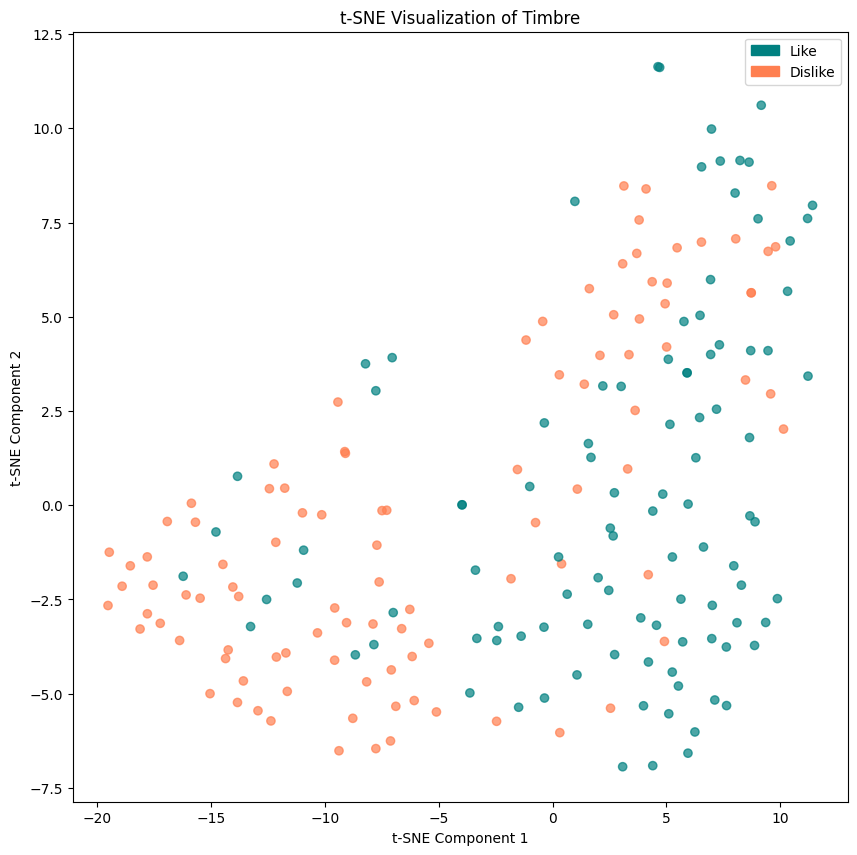
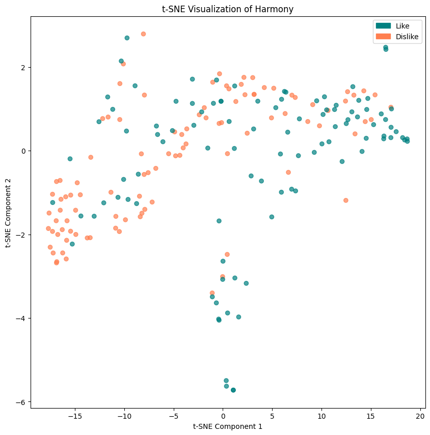
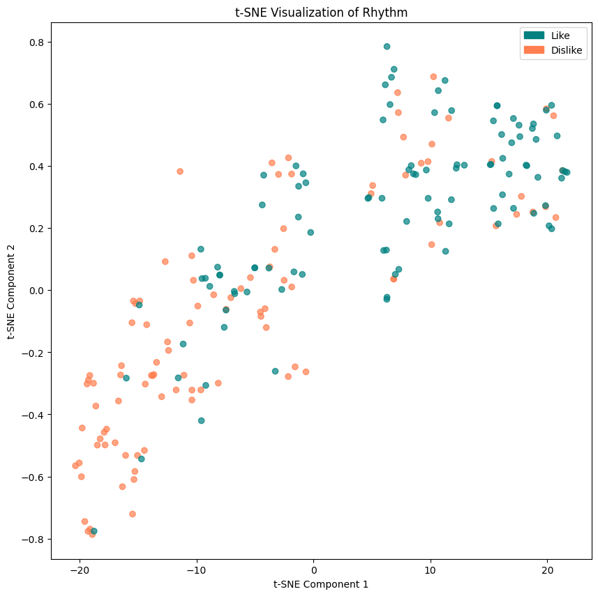
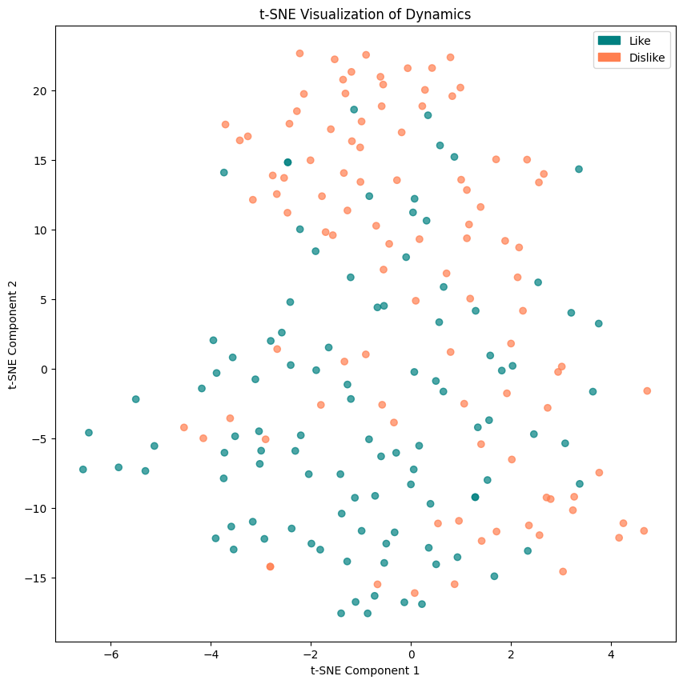

# SongGuardian :drum:

Music plays a great role in peoples life and influences different parts of the daily routine such as the mood or the performance in sports, study, work, etc. Therefore, in the contemporary era of information many researchers have dedicated their work to improving music recommendation systems that enable people to find new music or allow artists to reach a wider public.

This work emerges from the hypothesis that not all humans are sensitive to the same features and that the first question should be instead, what makes us like or dislike music?

Therefore, I decided to study the feature spaces generated by the songs I like the most and the ones I hate the most looking forward to detect which aspect of music is the one I am more sensitive to. Is it the timbre? the rhythm? a combination of both?. Although I am sure the context might influence a lot the emotions perceived in a musical piece, there is a pattern why friends and family tend to give accurate recommendations that lacks of any biases based on the context. This means they are capable of learning your musical taste, but are probably not able to describe it.

The aim of this work is precisely trying to detect the patterns that represent my musical taste in a supervised manner. Taking an accurate sampling strategy, using the appropriate learning considerations I want to separate songs into two distinct classes, songs I like and songs I would dislike using CNN.

## Installation instructions :computer:
To replicate the results follow this steps:

Install the requirements list either with pip
```
pip install -r requirements.txt
```
or create an environment
```
conda create --name musical_taste --file requirements.txt
```
Then activate your environment
```
conda activate musical_taste
```

## Feature extraction :musical_note:
My dataset is a combination of two playlists\
[:cd: Songs I love](https://open.spotify.com/playlist/0c5l61Nfs7Ie0TrJ5NP5JJ?si=a7bdd16bc35c44b1)\
[:cd: Songs I hate](https://open.spotify.com/playlist/37i9dQZF1EUMDoJuT8yJsl?si=3c0fe5d717994539)

You can build your own dataset and create a folder Dataset with two subfolders named Like and Dislike.
The first step is making all songs to have the same length
```
python .\data_processing.py
```
To extract the features run:
```bash
python main.py --task "build_dataset" --features timbre harmony rhythm
```

For my experiment, all the features were stored as a pickle file
[Dataset :musical_score:](dataset_features.pckl)

The results with learning machines can be found at the following notebook :
[Notebook  :musical_keyboard:](supervising_my_musical_taste.ipynb)

## Musical Features Used :headphones:
To represent different aspects of music, we extracted the following features:

### **Timbre** 🎨
Timbre refers to the "color" or "texture" of a sound, which distinguishes different types of sound production (e.g., a piano vs. a guitar)
- **Mel-frequency cepstral coefficients (MFCCs):** Capture the tonal quality of a sound.

### **Harmony** 🎼
 Harmony refers to the combination of different musical notes played or sung simultaneously, creating chords and chord progressions.
- **Chromagram:** Represents harmonic content and chord progressions.

### **Rhythm** 🥁
Rhythm refers to the temporal structure of music, including tempo, beat, and rhythmic patterns.
- **Zero-Crossing Rate:** Measures percussiveness by detecting rapid amplitude changes.
- **Tempo (BPM):** Extracts the song’s beat per minute.
- **Spectral Flux:** Measures rhythmic complexity by detecting spectral changes.
- **Pulse Clarity:** Indicates the strength and regularity of the beat.

### **Dynamics**
Dynamics refers to the variation in loudness or intensity of the music over time.
- **RMS (Root Mean Square) Error**: Represents the average power of the signal, which is a measure of loudness.

These features help analyze how different aspects of a song contribute to musical preference.

## Feature Analysis


### **t-SNE Visualizations**






### **Analysis of t-SNE Visualizations**
- **Rhythm** appears to be the most discriminative feature, as it shows the clearest separation between "Like" and "Dislike" classes in the t-SNE plot.
- **Timbre** and **Harmony** show some clustering but lack clear separation, suggesting they may need to be combined with other features to improve classification.
- **Dynamics** seems to be the least discriminative feature on its own, as the t-SNE plot shows no clear patterns or separation.

## Multilayer Perceptron (MLP) :musical_note:
In order to supervise the learning process of my musical taste I used a self created
[Multilayer Perceptron ](https://github.com/IsitaRex/Supervising-My-Musical-Taste/blob/810f596b126773d3c525ab098154cfee992d2f46/Multilayer%20Perceptron/MLP.py)
which receives a list of
[layers](https://github.com/IsitaRex/Supervising-My-Musical-Taste/blob/810f596b126773d3c525ab098154cfee992d2f46/Multilayer%20Perceptron/Layer.py) and a learning rate.

### Example model
To train a RNN with 100 epochs, a batch size of 32 and learning rate of 0.1 run:
```
python main.py --epochs 100 --batch_size 32 --lr 0.1
```

